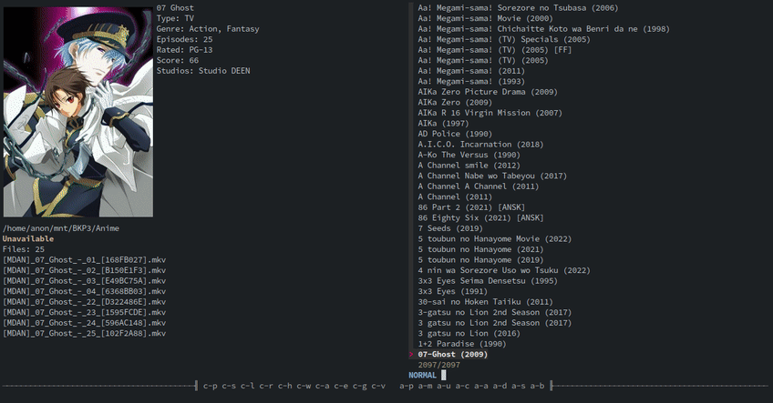

## IMPORTANT: Edit/Read the scripts before running them 

### Notes:
- The script expects that all files in `$ANIME_DIR` are symlinks
- Before running `fzfanime.sh` create `$DB` and `$MALDB`
- By default AniList is used as main database

---

### Defaults
```bash
ANIME_DIR=~/Videos/Anime    
BACKEND=ueberzug    # ueberzug kitty
DB=anilist.json     # generated with tools/update_anilist.py
MALDB=maldb.json    # generated with tools/update_maldb.py
PLAYER='mpv'                 
```
---

### Dependencies
- [fzf](https://github.com/junegunn/fzf)
- [jq](https://github.com/stedolan/jq)
- [ueberzug](https://github.com/b1337xyz/ueberzug) (optional)
- [devour](https://github.com/salman-abedin/devour) (optional)
- [mpvhistory.lua](https://github.com/b1337xyz/config/blob/main/mpv/scripts/mpvhistory.lua) (optional)

---

| Bind   | Description                                                  |
|---     |---                                                           |
|Alt-c   | Continue watching                                            |
|Alt-s   | Shuffle list                                                 |
|Alt-a   | Add current line to `$WATCHED_FILE`                          |
|Alt-d   | Remove current line from `$WATCHED_FILE`                     |
|Alt-u   | Unlist entries from `$WATCHED_FILE`                          |
|Ctrl-l  | Load `$ANIMEHIST`                                            |
|Ctrl-w  | Load `$WATCHED_FILE`                                         |
|Alt-p   | Select `path`                                                |
|Alt-r   | Select `rated`                                               |
|Ctrl-v  | Select `type`                                                |
|Alt-b   | Sort by size                                                 |
|Alt-l   | Sort by ctime (time of last modification of file)            |
|Ctrl-e  | Sort by episodes                                             |
|Ctrl-g  | Sort by genre                                                |
|Ctrl-s  | Sort by score                                                |
|Ctrl-y  | Sort by year                                                 |
|Ctrl-a  | List only available entries                                  |
|Ctrl-h  | List only entries rated Rx                                   |
|Ctrl-b  | Go to first item of the list                                 |
|Ctrl-t  | Go to last item of the list                                  |
|Ctrl-p  | Play current line with `$PLAYER`                             |
|Ctrl-r  | Reload                                                       |

---


