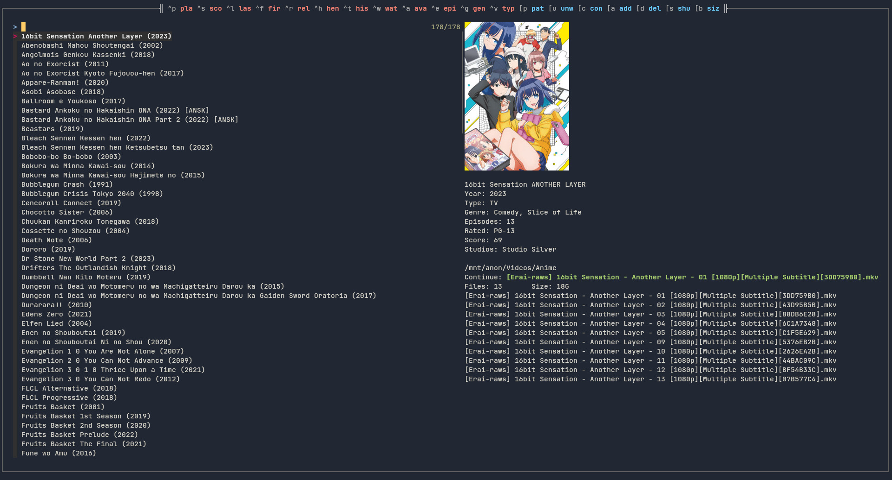

# *fzfanime*
A Command Line Interface to browse and watch anime locally.

```
Usage: fzfanime.sh [options ...]

Options:
    -u --update             Update/create $DB
    -p --player <player>    Video player (default: mpv)
    -b --backend <backend>  Image preview (default: ueberzug) (available: ueberzug kitty feh viu chafa)
    -f --fallback <backend> If $DISPLAY is unset fallback to <backend> (default: viu)
    -c --clean              Remove entries where .fullpath does not exist
    -e --edit               Edit the config file
    -q --quit-on-play       Quit fzf when playing
    -h --help               Show this message

Notes:
    - --option=value is not supported, use --option value
    - $DB generated using Anilist APIv2 -> https://anilist.gitbook.io/anilist-apiv2-docs
      and Jikan APIv4 -> https://api.jikan.moe/v4/anime
    - By default AniList is used as main database
```
#### `$DB` format:
```json
{
  "<Anime> (1998)": {
    "mal_id": 400,
    "is_adult": false,
    "title": "Anime",
    "year": 1998,
    "genres": ["Action", ...],
    "episodes": 24,
    "score": 74,
    "image": "<local path to the image>",
    "type": "TV",
    "rated": "R+",
    "duration": 25,
    "studios": ["Sunrise", ...],
  }
}, ...
```

## Dependencies

- [fzf](https://github.com/junegunn/fzf)
- [jq](https://github.com/stedolan/jq)
- [devour](https://github.com/salman-abedin/devour) (optional)
- [mpvhistory.lua](https://github.com/b1337xyz/config/blob/main/mpv/scripts/mpvhistory.lua) (optional)
- [dmenu](https://tools.suckless.org/dmenu/) (optional)

Image Preview (optional)
- [ueberzug](https://github.com/b1337xyz/ueberzug)
- [viu](https://github.com/atanunq/viu#from-source-recommended)
- [chafa](https://hpjansson.org/chafa/)
- [feh](https://feh.finalrewind.org/)
    - [xdotool](https://www.semicomplete.com/projects/xdotool/) 
    - `xwininfo` (`xorg-xwininfo` on Arch btw)

## Setup
Arch Linux
```
sudo pacman -Syu git python python-pip fzf jq ueberzug --needed
```  
Debian
```
sudo apt install git python3 python3-pip fzf jq ueberzug -y
```

```
git clone https://github.com/b1337xyz/fzfanime.git
cd fzfanime
python3 -m pip install -U -r requirements.txt
bash fzfanime.sh
```

[Settings](https://github.com/b1337xyz/fzfanime/blob/main/fzfanime.sh#L55)

---



## Key bindings
```
alt-c   : Continue watching
alt-s   : Shuffle list
alt-a   : Add current line to `$WATCHED_FILE`
alt-d   : Remove current line from `$WATCHED_FILE`
alt-u   : Unlist entries from `$WATCHED_FILE`
alt-m   : Menu mode
ctrl-l  : Load `$ANIMEHIST`
ctrl-w  : Load `$WATCHED_FILE`
ctrl-v  : Select `type`
alt-p   : Select `path`
alt-r   : Select `rated`
alt-b   : Sort by size
alt-l   : Sort by ctime (time of last modification of file)
ctrl-e  : Sort by episodes
ctrl-g  : Sort by genre
ctrl-s  : Sort by score
ctrl-y  : Sort by year
ctrl-a  : List only available entries
ctrl-h  : List only entries rated Rx
ctrl-b  : Go to first item of the list
ctrl-t  : Go to last item of the list
ctrl-p  : Play current line with `$PLAYER`
ctrl-r  : Reload
end     : Preview bottom
home    : Preview top
```
